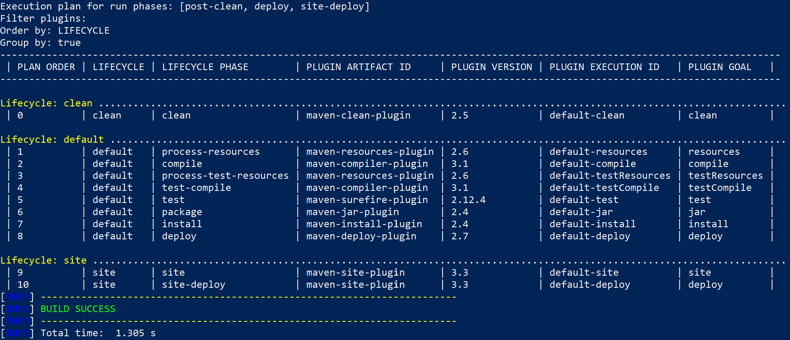

# Lifecycle Maven Plugin

A Maven 3.x plugin to inspect the lifecycle of your project.
The plugin provides goals aimed at helping to inspects your project lifecycle phases and
if a plugin-goal is executed and when. It includes the ability to list all plugin-goal mapping to executed phases
and group the execution plan result by lifecycle/phases/plugin/goal.

### Quick links
- Introduction
- Usage
- Goals documentation

### Feature requests
